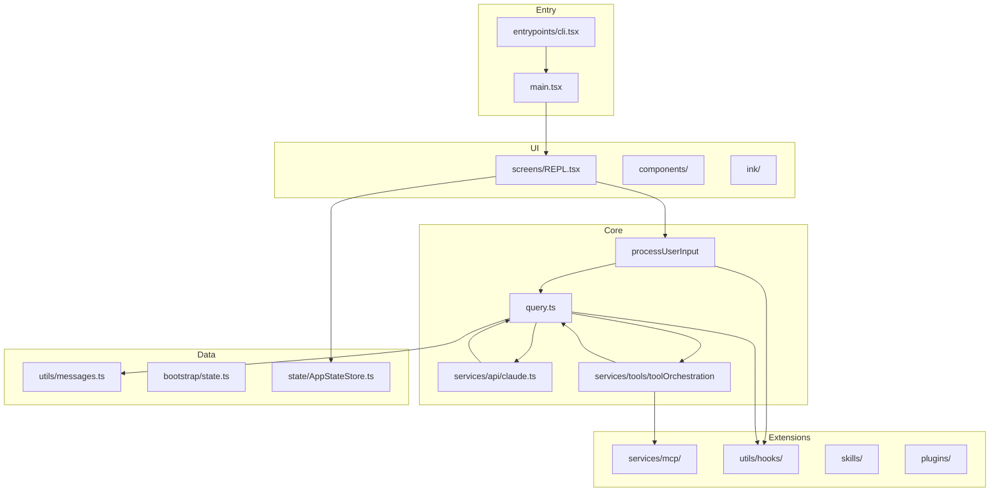

# Strategy & Architecture

> [← Back to Index](./00-index.md) | Next: [Data Flow](./02-data-flow-and-transformations.md)

---

## Overall Strategy

Claude Code implements a **classic agentic loop** with a terminal-native UX:

1. **Accept user input** (text, images, slash commands, pasted files)
2. **Build context** (conversation history + system prompt + memory + attachments)
3. **Call the Anthropic Messages API** (streaming)
4. **Parse assistant response** (text, thinking, tool_use blocks)
5. **Execute tools** (with permissions, hooks, concurrency rules)
6. **Append tool results** as user messages
7. **Repeat** until the model stops calling tools or a stop condition fires
8. **Compact** context when token limits approach

This loop lives in `src/query.ts` (`query()` → `queryLoop()`). Everything else — UI, CLI routing, MCP, memory, bridge — feeds into or wraps this loop.

---

## Architectural Principles

### 1. Lazy loading & fast paths

`src/entrypoints/cli.tsx` is the true process entry. It uses **dynamic imports** so lightweight operations (`--version`, daemon workers, bridge mode) never load the 785KB `main.tsx`.

### 2. Compile-time feature gates

```typescript
import { feature } from 'bun:bundle';

if (feature('BRIDGE_MODE') && args[0] === 'remote-control') {
  // Only present in builds that include bridge
}
```

Features like `COORDINATOR_MODE`, `KAIROS`, `BG_SESSIONS`, `DUMP_SYSTEM_PROMPT` are stripped from external builds via Bun's `feature()` DCE.

### 3. Dual runtime: interactive vs headless

| Concern | Interactive | Headless (`-p`) |
|---------|-------------|-----------------|
| UI | Ink/React REPL | None (stdout JSON) |
| Permissions | Dialog components | Structured protocol |
| Entry | `REPL.tsx` → `query()` | `cli/print.ts` → `QueryEngine` |
| Output | Rendered messages | `stream-json` / `json` |

Both paths converge on the same `query()` generator.

### 4. Layered configuration

Settings merge from MDM → policy → user → project → local → CLI flags. See [layers/12-configuration.md](./layers/12-configuration.md).

### 5. Tool-centric extensibility

New capabilities are added as **tools** (with Zod schemas, permission checks, prompts) or **MCP servers** (external tools proxied in). Slash commands and skills are a UX layer on top.

---

## High-Level Component Diagram



---

## Directory Responsibilities

| Directory | Responsibility |
|-----------|----------------|
| `src/entrypoints/` | Process entry, init, SDK type exports |
| `src/main.tsx` | Commander CLI, flags, subcommands |
| `src/cli/` | Headless print mode, background sessions |
| `src/screens/` | Full-screen Ink views (REPL, onboarding) |
| `src/components/` | Reusable UI (messages, permissions, dialogs) |
| `src/ink/` | Custom terminal renderer (fork of Ink) |
| `src/query.ts` | Agent loop |
| `src/QueryEngine.ts` | SDK/headless conversation API |
| `src/Tool.ts` + `src/tools/` | Tool definitions |
| `src/services/` | API, MCP, OAuth, analytics, compaction |
| `src/commands/` | Slash command implementations |
| `src/utils/` | Config, settings, permissions, messages |
| `src/state/` | React app state |
| `src/hooks/` | React hooks + permission orchestration |
| `src/bridge/` | Remote Control (local machine as cloud env) |
| `src/coordinator/` | Multi-agent swarm coordinator |
| `src/buddy/` | Terminal Tamagotchi companion |
| `src/memdir/` | Auto-memory (MEMORY.md) |
| `src/skills/` | Bundled slash-command skills |

---

## Startup Sequence

```
process start
  └─ entrypoints/cli.tsx
       ├─ fast path? (--version, bridge, daemon, mcp, …) → return
       └─ dynamic import main.tsx
            └─ Commander preAction hook
                 ├─ MDM / keychain unlock
                 ├─ init() — configs, telemetry, OAuth prefetch
                 └─ initSinks() — analytics
            └─ .action() handler
                 ├─ setup() — session ID, cwd, worktree, trust
                 ├─ load settings, MCP, agents, plugins, skills
                 ├─ showSetupScreens() — trust dialog, onboarding
                 └─ launchRepl() OR cli/print.ts
```

Details: [layers/01-entry-and-cli.md](./layers/01-entry-and-cli.md)

---

## The Agent Loop (Heart of the System)

`query()` in `src/query.ts` is an **async generator** yielding stream events and messages:

```typescript
export async function* query(params: QueryParams): AsyncGenerator<
  StreamEvent | Message | …,
  Terminal
> {
  // Delegates to queryLoop(); notifies command lifecycle on exit
}
```

Each iteration of `queryLoop()`:

1. Destructure mutable `state` (messages, toolUseContext, compact tracking)
2. Check token budget / auto-compact thresholds
3. Build `messagesForQuery` (compact boundary, snip, tool result budget)
4. Prefetch relevant memory attachments
5. Stream API call via `services/api/claude.ts`
6. Yield assistant deltas to UI
7. Extract `tool_use` blocks → `runTools()`
8. Append tool results; check stop hooks
9. `continue` or return `Terminal`

Details: [layers/04-query-engine.md](./layers/04-query-engine.md)

---

## Internal Codename & Analytics

- Analytics events use the `tengu_*` prefix
- README and undercover mode confirm **Tengu** as the internal name
- `src/utils/undercover.ts` strips internal model codenames from external-facing output

---

## What Makes This Different from a Simple Chat CLI

| Feature | Implementation |
|---------|----------------|
| **Compaction** | `services/compact/` — auto, micro, reactive, snip |
| **Tool concurrency** | Read-only tools run in parallel (up to 10) |
| **Permission modes** | default, plan, acceptEdits, bypassPermissions, auto |
| **Sub-agents** | `AgentTool` spawns isolated query loops |
| **MCP** | External tool servers wired into tool pool |
| **Memory** | `MEMORY.md` + dream consolidation subagent |
| **Hooks** | User-defined lifecycle interception |
| **Remote** | Bridge mode runs tools on user's machine from cloud |

---

## Related Docs

- [02-data-flow-and-transformations.md](./02-data-flow-and-transformations.md) — step-by-step data transformations
- [topics/messages.md](./topics/messages.md) — message type system
- [topics/extension-points.md](./topics/extension-points.md) — how to extend the system
- [03-file-locator.md](./03-file-locator.md) — find any module quickly
