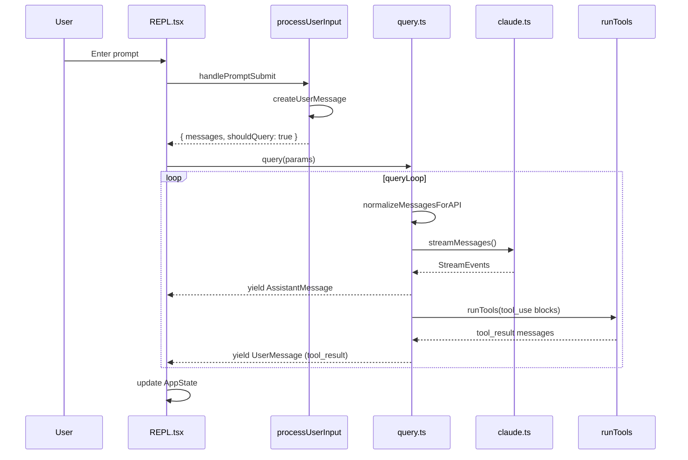

# Data Flow & Transformations

> [← Back to Index](./00-index.md) | See also: [topics/messages.md](./topics/messages.md)

This document traces how data moves through Claude Code from keystroke to API and back, with concrete examples.

---

## Overview Pipeline

```
Terminal keystrokes
  → PromptInput (REPL.tsx)
  → handlePromptSubmit
  → processUserInput
  → Message[] (internal model)
  → query() loop
  → normalizeMessagesForAPI
  → Anthropic API MessageParam[]
  → streaming response
  → AssistantMessage + tool_use blocks
  → runTools → tool_result UserMessages
  → (loop or stop)
  → AppState + sessionStorage JSONL
```

---

## Example 1: Simple Text Prompt

**User types:** `fix the typo in README.md`

### Step 1 — Raw input capture

`PromptInput` in `screens/REPL.tsx` captures a string. On Enter, `handlePromptSubmit` (`utils/handlePromptSubmit.ts`) is called.

### Step 2 — Input routing

`processUserInput` (`utils/processUserInput/processUserInput.ts`) checks:

| Check | Result for this input |
|-------|----------------------|
| Slash command (`/compact`)? | No |
| Bash prefix (`!`)? | No |
| Ultraplan keyword? | No |
| Image paste? | No |

→ Falls through to `processTextPrompt` → creates a `UserMessage`.

### Step 3 — UserMessage creation

```typescript
// Simplified from createUserMessage in utils/messages.ts
{
  type: 'user',
  uuid: '<random-uuid>',
  timestamp: '2026-06-08T…',
  message: {
    role: 'user',
    content: 'fix the typo in README.md'
  }
}
```

Hooks may inject `AttachmentMessage`s (memory, skill discovery) before the query starts.

### Step 4 — Query loop entry

`REPL.tsx` calls `query()` with:

```typescript
{
  messages: [...priorMessages, newUserMessage],
  systemPrompt: await getSystemPrompt(...),
  toolUseContext: { tools, mcpClients, abortController, ... },
  canUseTool: permissionGate,
  ...
}
```

### Step 5 — API normalization

`normalizeMessagesForAPI(messages)` strips UI-only fields, pairs `tool_use`/`tool_result`, removes empty messages, handles compact boundaries.

Output shape matches Anthropic SDK `MessageParam[]`:

```json
[
  { "role": "user", "content": "fix the typo in README.md" }
]
```

Plus system prompt and tool schemas sent separately.

### Step 6 — API streaming response

The model may respond with:

```json
{
  "role": "assistant",
  "content": [
    { "type": "text", "text": "I'll read the file first." },
    {
      "type": "tool_use",
      "id": "toolu_01ABC",
      "name": "Read",
      "input": { "file_path": "/project/README.md" }
    }
  ]
}
```

This becomes an `AssistantMessage` in internal format (with `uuid`, `timestamp`, `usage`, etc.).

### Step 7 — Tool execution

`runTools()` in `services/tools/toolOrchestration.ts`:

1. Partitions tool calls by `isConcurrencySafe()` (Read = parallel-safe)
2. Calls `canUseTool()` → permission check
3. Invokes `FileReadTool.call(input, context)`
4. Yields a `UserMessage` with `tool_result` content:

```json
{
  "type": "tool_result",
  "tool_use_id": "toolu_01ABC",
  "content": "# Claude Code\n\nClaude Code is..."
}
```

### Step 8 — Loop continues

Messages array now has: user → assistant (with tool_use) → user (tool_result).

`queryLoop` iterates again → API call with full history → model may call `Edit` tool → repeat.

### Step 9 — Persistence

`sessionStorage.ts` appends each message to:

```
~/.claude/projects/<project-hash>/<session-id>.jsonl
```

One JSON object per line.

---

## Example 2: Slash Command (`/compact`)

**User types:** `/compact`

### Routing

`processUserInput` → `parseSlashCommand` → `findCommand('compact')` in `commands.ts`.

Slash commands return `{ messages: [...], shouldQuery: false }` — they **bypass the API** unless the command explicitly triggers a query.

`/compact` runs compaction logic locally, inserts a `SystemCompactBoundaryMessage`, and updates the message list without an API round-trip (unless configured otherwise).

See [topics/commands-and-skills.md](./topics/commands-and-skills.md).

---

## Example 3: Headless SDK Mode

**User runs:** `claude -p "list files" --output-format stream-json`

### Path

```
main.tsx action handler
  → cli/print.ts
  → QueryEngine.submitMessage()
  → query() (same loop)
  → mappers in entrypoints/sdk/
  → stdout: JSON lines (SDKMessage format)
```

Permission prompts use a structured stdin/stdout protocol instead of Ink dialogs.

---

## Data Structure Conversions

### Internal Message → API Message

| Internal (`Message`) | API (`MessageParam`) |
|---------------------|----------------------|
| `UserMessage` | `{ role: 'user', content: … }` |
| `AssistantMessage` | `{ role: 'assistant', content: … }` |
| `SystemMessage` | Injected into system prompt or filtered |
| `ProgressMessage` | **Stripped** — UI only |
| `AttachmentMessage` | Merged into next user turn or system context |
| `StreamEvent` | **Not persisted** — live UI deltas |

Key function: `normalizeMessagesForAPI()` in `utils/messages.ts`.

### API Response → Internal Message

Streaming deltas from `services/api/claude.ts` are assembled into `AssistantMessage` via `createAssistantMessage()`. Thinking blocks, redacted thinking, and tool_use blocks are preserved.

### Internal Message → SDK Output

`cli/print.ts` and SDK mappers convert to `SDKMessage` types defined in `entrypoints/agentSdkTypes.ts`:

```typescript
// Example SDK output types
SDKAssistantMessage | SDKUserMessage | SDKResultMessage | …
```

### Tool Input/Output

```
API tool_use.input (JSON)
  → Zod validation via tool.inputSchema
  → tool.call(validatedInput, toolUseContext)
  → Tool output (typed per tool)
  → serialized to string for tool_result.content
```

---

## Attachment Injection Flow

Before each API call, `getAttachmentMessages()` may add:

| Attachment type | Source |
|----------------|--------|
| Memory files | `memdir/` — MEMORY.md, relevant chunks |
| Hook output | User-defined hooks on SessionStart, UserPromptSubmit |
| Skill discovery | Skill search prefetch |
| IDE context | Selection from VS Code bridge |
| Command metadata | Slash command structured tags |

Attachments appear as `AttachmentMessage` or are folded into `userContext` / `systemContext` strings via `prependUserContext()` / `appendSystemContext()`.

---

## Compaction Transformation

When context exceeds token threshold:

```
Message[] (100+ messages, 180k tokens)
  → autoCompact / buildPostCompactMessages
  → SystemCompactBoundaryMessage (marks cutoff)
  → Summarized context (API call to summarize)
  → Message[] (compact summary + recent messages, ~50k tokens)
```

The compact boundary ensures `getMessagesAfterCompactBoundary()` only sends relevant history to the API.

---

## Tool Result Budget

Large tool outputs (e.g. 50KB file read) may be spilled to disk:

```
tool_result content (huge string)
  → applyToolResultBudget()
  → file written to ~/.claude/tool-results/<id>
  → tool_result replaced with preview + file path
```

---

## Permission Decision Flow

```
tool_use block
  → canUseTool(tool, input, context)
    → check permission rules (allow/deny/ask)
    → run PreToolUse hooks
    → if 'ask': show UI dialog (interactive) or structured prompt (headless)
    → PermissionResult: 'allow' | 'deny' | 'ask'
  → if deny: synthetic tool_result with rejection message
  → if allow: tool.call()
```

See [layers/07-permissions.md](./layers/07-permissions.md).

---

## State Mutations per Turn

| State location | What changes |
|----------------|--------------|
| `AppStateStore` (React) | messages[], permission mode, notifications |
| `bootstrap/state.ts` (global) | sessionId, cost, model usage, feature latches |
| `toolUseContext` (per-query) | file cache, query tracking, abort signal |
| Disk (sessionStorage) | JSONL transcript append |
| Disk (memdir) | MEMORY.md updates (via dream/manual) |

See [topics/state-management.md](./topics/state-management.md).

---

## Sequence Diagram: Full Turn



---

## Related Docs

- [topics/messages.md](./topics/messages.md) — full message type reference
- [layers/04-query-engine.md](./layers/04-query-engine.md) — query loop internals
- [layers/06-tools.md](./layers/06-tools.md) — tool execution details
- [layers/03-input-processing.md](./layers/03-input-processing.md) — input routing
